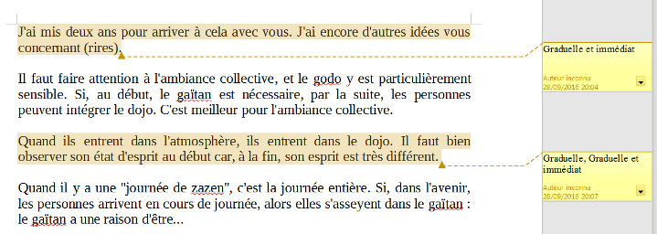
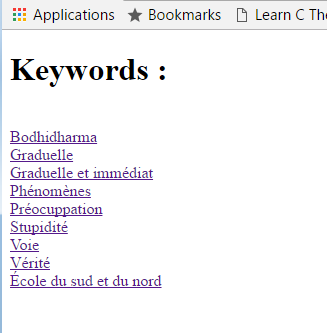
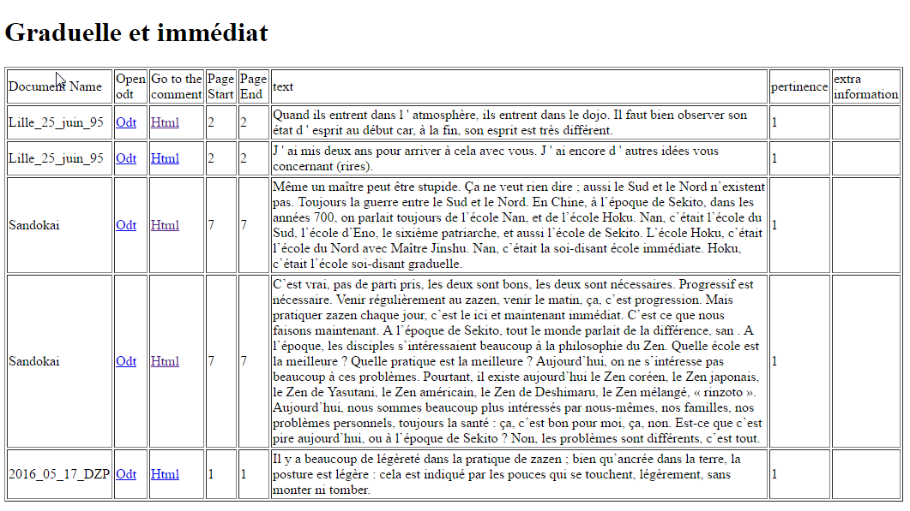
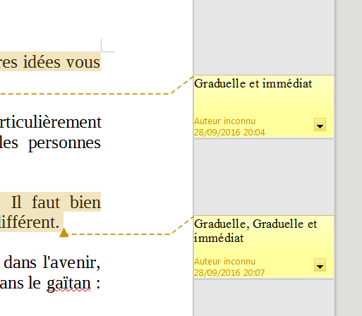
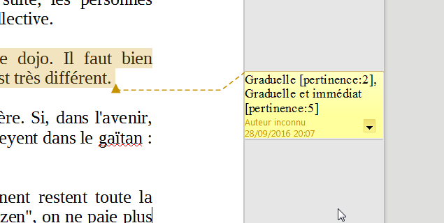

# zen-index
zen-index is for manual indexing, when you think a search engine is not going to give you relevant results because a human interpretation is needed to associate the right keywords to the different parts of a text.  

The goal of zen-index is to aggregate the keywords annotations made on odt files in a single report.

Thus the first step is completely manual, you create annotations on some parts of the text where you give the relevant keyword that should be associated to the annotated text.

Then in the second step you use the zen-index program to generate the report against the directory where you put the odt documents.

## Installation 

You need java 8 to run this program, you don't need to have open or libre office installed, but we recommend it to experiment changes. 

Execution is about running a jar (see usage) you can download the jar in the release page.

## Usage 

Let's imagine you have this directory structure 

       the_root_directory 
       |-sub
       | |-2016_05_17_DZP.odt    
       |-Lille_25_juin_95.odt
       |-Sandokai.odt

In the odt files you made some annotation with what you think are the relevant keywords that should be associated.

Then you run zen-index against the directory containing your odt files.

    java -jar zenindex-1.0.0-jar-with-dependencies.jar /path/to/the_root_directory
     
Now your directory include an index.html file, a keywords directory, and all the odt files have a html preview.   

       the_root_directory
       |-index.html 
       |-keywords
       | |-Bodhidharma.html
       | |-École du sud et du nord.html
       | |-Graduelle et immédiat.html
       | |-Graduelle.html
       | |-Phénomènes.html
       | |-Préocuppation.html
       | |-Stupidité.html
       | |-Vérité.html
       | |-Voie.html
       |-sub
       | |-2016_05_17_DZP.html
       | |-2016_05_17_DZP.odt 
       |-Lille_25_juin_95.html   
       |-Lille_25_juin_95.odt
       |-Sandokai.html
       |-Sandokai.odt
       
In the index.htlm you find a link to all the keywords

 
In a keyword page you find all the references to this keyword in the documentation 

## Annotation rule 

A keyword could be a single word or a group of word. The seperator between keyword is the comma : ","

**First example :** 

 
The first annotated text in the document has only one keyword : "Graduelle et immédiat".
But the second annotatded text has two keywords : "Graduelle" and "Graduelle et immédiat"

You can add a pertinence score if you think the text is really relevant for the keyword. The default pertinence is one in this case you use this syntax

    my keyword [pertinence:3] 
    
**Second example**

Like in the previous example the annotated text has two keywords but "Graduelle" has a pertinence of 2 while "Graduelle et immediat" has a pertinence of 5.  

## Want to change the code ?

### Main Components :
 
Spring, JPA/hibernate, H2, Freemarker, JUnit4, mvn

### Running the test :

    mvn test 

### Build the jar :

    mvn clean compile assembly:single
    
### Changing the html template 

Have a look in src/main/resources/templates we use freemarker.

